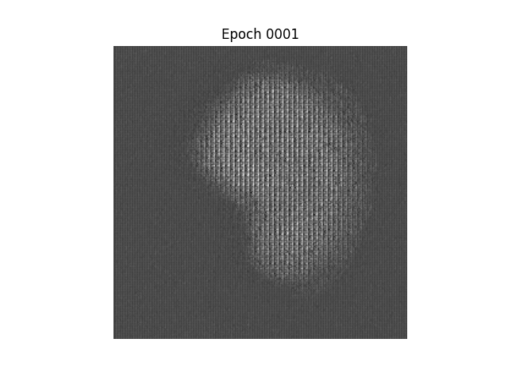
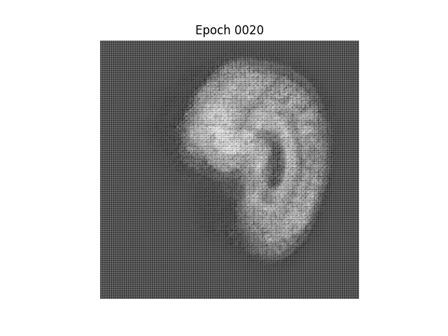

# Variational Autoencoder of MRI's of the Brain involving Alzheimer's Disease

---

**Author:** Jessica Sullivan

**Student Number:** 45799930

**Assignment:** COMP3710 Supplementary Assessment

---

## Description of Model

The model constructed was a Variation Autoencoder (VAE). A VAE is based off the structure of an autoencoder, with extra steps of normalisation inbetween. An autoencoder combines two types of Convolutional Nural Networks (CNN) together; and encoder and decoder. CNN have multiple convolutional layers, usually with either a max pooling (decrease in the size of the data) or an upsampling (increasing in the size of the data) to connect layers. An encoder starts with the dataset and through multiple convolutional layers and max pooling results with an output of much smaller size. A decoder is the opposite. Starting with the input, it will go through the convolutional layers and upsampling to create an output with a larger size. An autoencoder is an encoder which has its output fed through a decoder.

---

## Description of the DataSet

The ADNI dataset contains information of three different key groups (as referenced [here](https://adni.loni.usc.edu/)):

* completely normal healthy elders
* elders with mild memory problems or mild cognitive impairments
* elders with Alzheimer's disease dementia

The data that we will be analyzing is of the magnetic resonance images (MRI) of the brain involving these three categories of participants. The initial training will be on the scans with Alzheimer's disease , but we will also do it on those normal elders to compare. The dataset come as a directory with train and test sub directories. We will only use the train subdirectory, where the AD directory within the train subdirectory contains the MRI images of brains of people with Alzheimer's Disease. At the end we will come back to the NC directory to compare with those without Alzheimer's. The images seem to be of stze `240 x 256 pixles` each. We will be changing this to `240 x 240 pixels` for ease of use and when looking at the images there is plenty of black space so this should not cut off any of the iimpotrant information of the images.

---

## Description of the Files

**module.py:** Contains the code that creates the model for the autoencoder.

**dataset.py:** Imports and preprocesses the dataset for this project.

**train.py:** The main file used to run the project which will train the dataset and produce all outputs required.

---

## Required for Running

### File Location

Please add the dataset given to us within this directory and do not change any names. The pathway that will be predominantly used is the `./AD_NC/train/AD` pathway.

### Versions Required

```commandline
Tensorflow: 2.10.0
Matplotlib: 3.5.3

```

---

## Outputs of Trained Model

### Reduced DataSet

For initial training purposes, the dataset was cut down to only include 400 images so that it would be quicker and take less computing power to train. This is the output of the trained model after each epoch for when the dataset was reduced to 400 images

#### Alzheimer's Disease Training




#### Nurotypical Training 

---

## Plots

### Convergence Plots

### Loss function Equations

---

## Visualizations


---


## Answer to Report Question

**Question:**

Do your visualizations show any relationship or separation with respect between the Alzheimer's disease and healthy groups?

**Answer:**

yes or no?

---
