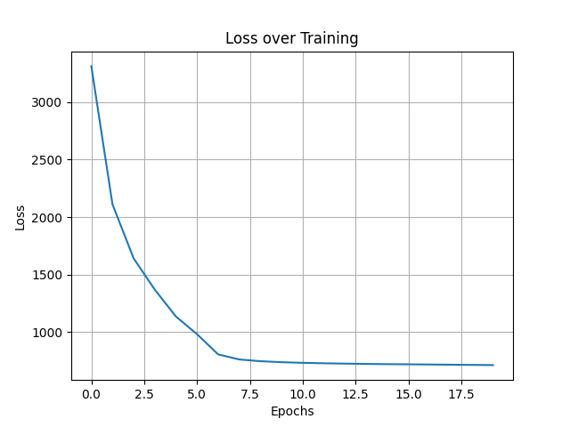

# Variational Autoencoder of MRI's of the Brain involving Alzheimer's Disease

---

**Author:** Jessica Sullivan

**Student Number:** 45799930

**Assignment:** COMP3710 Supplementary Assessment

---

## Description of Model

The model constructed was a Variation Autoencoder (VAE). A VAE is based off the structure of an autoencoder, with extra steps of normalisation inbetween. An autoencoder combines two types of Convolutional Nural Networks (CNN) together; and encoder and decoder. CNN have multiple convolutional layers, usually with either a max pooling (decrease in the size of the data) or an upsampling (increasing in the size of the data) to connect layers. An encoder starts with the dataset and through multiple convolutional layers and max pooling results with an output of much smaller size. A decoder is the opposite. Starting with the input, it will go through the convolutional layers and upsampling to create an output with a larger size. An autoencoder is an encoder which has its output fed through a decoder. The difference with the VAE to an autoencoder is that there is a normalisation layer after the encoder. This structure can be seen [here](https://towardsdatascience.com/understanding-variational-autoencoders-vaes-f70510919f73) in the following graph:


A more detailed structure of a VAE is from [here](https://analyticsindiamag.com/choosing-between-gan-or-encoder-decoder-architecture-for-ml-applications-is-like-comparing-apples-to-oranges/) which shows the basis on the convolutional layers within the encoder and decoder and how they connect:


Now this graph dhows that there are 6 convolutional layers in the encoder and the decoder. This would change based on the size of the input, as a smaller image you could only downsize so many times, whereas bigger images could have more layers, are a larger stride length to keep the number of layers the same but get the data down to a similar size.

---

## Description of the DataSet

The ADNI dataset contains information of three different key groups (as referenced [here](https://adni.loni.usc.edu/)):

* completely normal healthy elders
* elders with mild memory problems or mild cognitive impairments
* elders with Alzheimer's disease dementia

The data that we will be analyzing is of the magnetic resonance images (MRI) of the brain involving these three categories of participants. The initial training will be on the scans with Alzheimer's disease , but we will also do it on those normal elders to compare. The dataset come as a directory with train and test sub directories. We will only use the train subdirectory, where the AD directory within the train subdirectory contains the MRI images of brains of people with Alzheimer's Disease. At the end we will come back to the NC directory to compare with those without Alzheimer's. The images seem to be of stze `240 x 256 pixles` each. We will be changing this to `240 x 240 pixels` for ease of use and when looking at the images there is plenty of black space so this should not cut off any of the iimpotrant information of the images.

---

## About the Code

### Description of the Files 

**module.py:** Contains the code that creates the model for the autoencoder.

**dataset.py:** Imports and preprocesses the dataset for this project.

**train.py:** The main file used to run the project which will train the dataset and produce all outputs required.

### Further Information:

The creation of the VAE started off as the code Shakes had in the INFOVAE lecture and was modified for my purposes, as well as simplified to make it easier for the code to be understood for someone looking in. For this VAE I kept the two convolutional layers for the encoder and decoder. However, because of the image size we could definily do more layer if further testing was required. This would influence the output of the code, I would predict for the better as after two convolutional laters with a stride of 2 we only get the image down to a 60x60 pixel image, so this could be improved without using too much more comuting power.

### Required for Running

#### File Location

Please add the dataset given to us within this directory and do not change any names. The pathway that will be predominantly used is the `./AD_NC/train/AD` pathway.

#### Versions Required

```commandline
Tensorflow: 2.10.0
Matplotlib: 3.5.3

```

---

## Outputs of Trained Model

### Reduced DataSet

For initial training purposes, the dataset was cut down to only include 400 images so that it would be quicker and take less computing power to train. This is the output of the trained model after each epoch for when the dataset was reduced to 400 images

#### Alzheimer's Disease Training


#### Neurotypical Training 


### Full DataSet

Once the code was completed and debugged with the smaller dataset, the code was run on the full dataset provided.

#### Alzheimer's Disease Training

This was completed on all the images in the directory `./AD_NC/train/AD/`.




#### Neurotypical Training

This was completed on the images in the directory `./AD_NC/train/NC/`.


---

## Breif Analysis of Plots

When looking at all the comparisons between the Epoch 1 and 20 for both the large and the small datasets it is clear to see that all the models did train. While the small set is not necessary, as I did start testing on this set and I already had the outputs its actually quite interesting to compare them. The two key results to look at for this assignment is the Alzheimers's training data for both the big and small set. The training was also completed on the neurotypical training so that the question on the report could be answered.

Overall the Alzheimer's dataset had the greatest loss at the begining of the training but gradually came down and by epoch 8 the graph of loss started to flatten out. The end loss of all the trainings ended very similar, being just above the 500 line. The one that is very different to the others is the Neurotypical training for the big dataset. The loss had evened out by about the third epoch, and stayed consistant. This to me meant that there where too many epochs, and the size of the batch should also be considered to be manipulated. Overall, the loss is still relatively high for every test, so I would consisder playing around with the batch size, number of epochs as well as the latent space size to see how this effected the training. However, all the outputs of epoch 20 are useful except for the big batch of the neurotypical data.

---

## Answer to Report Question

**Question:**

Do your visualizations show any relationship or separation with respect between the Alzheimer's disease and healthy groups?

**Answer:**

Yes.

When looking at both the full dataset and small batch datset for the neurotypical data, neither of them prodeuced very clear MRI scans when recomputing them. This could be becasuse the variables are not optimal for this dataset (latent size, batch size and number of epochs), or it could be because there is a large variance in the brain scans for the people that dont have Alzheimer's Disease. Now, without further testing and playing around with variables, this is the conclusion that I must come to from the results. Now it is quite clear in the Alzheimer's training that there are key parts of the brain that are highlighted or shadowed. In the full dataset output there are three key highlighted parts (front, middle, and bottom) and one key shaddowed part in the middle. Now this means that if someone was to have Alzheimer's disease we would be able to recognise this main pattern in the brain scan, while someone without Alzheimers could have anyother features, as the output is so vauge for the neurotypical training. 


---
